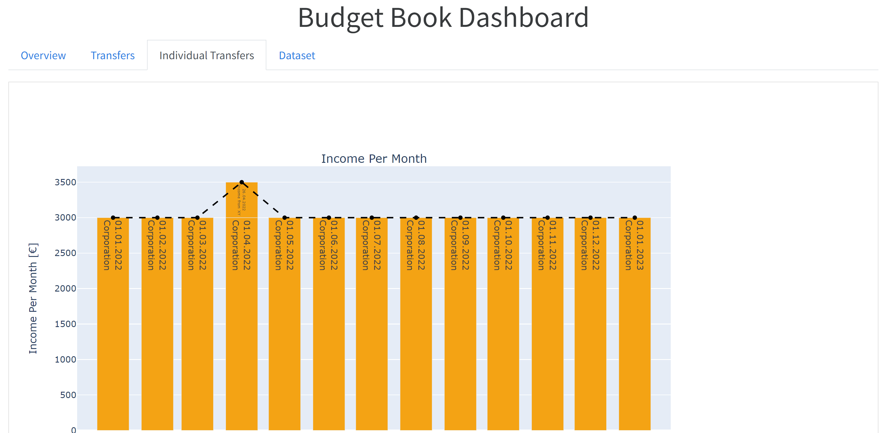
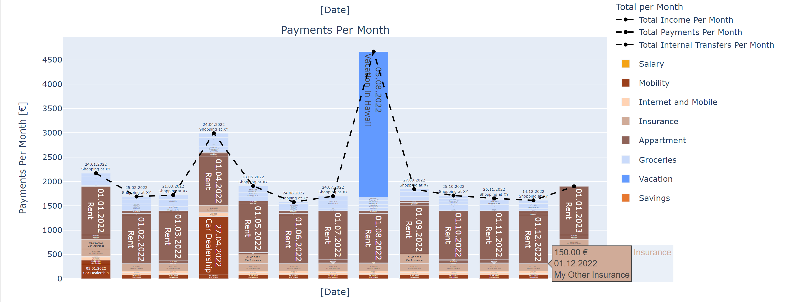
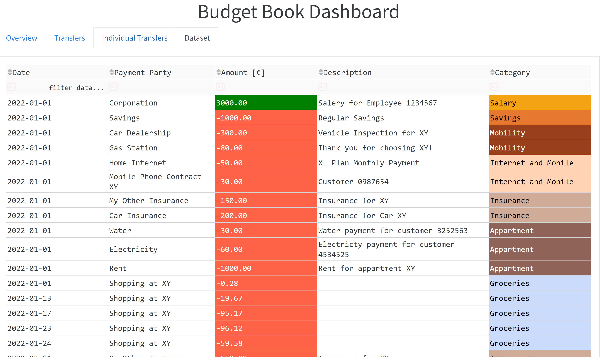
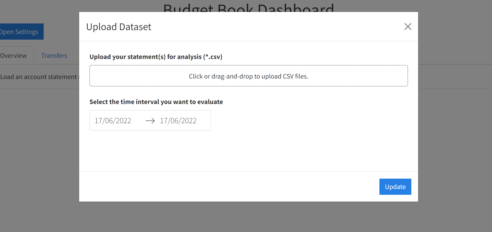
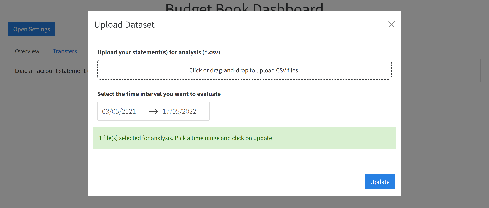

# Budget Book with Dash Web Interface

## Features
### Data Processing
- Can parse your bank account statements (currently in CSV format)
- Configurable statement parser to support different CSV structures.
- Can categorize your spendings and earnings based on custom filteres.
 - Filters can be tuned to classify all your spendings correctly!
 - Internal transactions to your own accounts can be filtered out!
 - If you prefer to manually write down regular spendings, you can do that too! Have a look at the second below!

### Visualization
 - Pie chart with spendings per category
   - Total spendings in dataset
   - Avg. per month
   - Percentage
  - Account balance change over time
  - Box plots with variance per category (not sure how useful :) )
  - Bar plots with spendings/earnings, grouped by category and month
  - Stacked bar-plots per month and category for:
    - Earnings/Income
    - Spendings/Payments
    - Internal transactions

## Experimental Features
- Can extract reocurring/regular payments and earnings from your existing account statements, based on the payment party and the transaction description. This feature can be enabled by passing `--generated-predictions` as commandline argument! Only works for csv statement files!

# Screenshots
### Overview

### Transfer Overview per Month and Category

### Detailed Visualization


### Dataset Table (searchable, filterable, sortable)



# How-To-Use
## How to customize the automatic category mapping
The tool uses a yaml file to configure how categories for transactions are determined.
This approach was choosen as automated tools never work perfectly and you most of the 
time end up with incorrectly classified transactions. Also, training automated systems require 
large prelabeled datasets.

The yaml file can define rules, based on a very simple ruleset. 
The rules are applied from top to bottom and the first match "wins".
For each category, a single rule or an AND/OR combination of several rules can be defined.
Currently, the rules can check if one of the give substrings is present in one of the dataset 
fields like payment party or description.

Take a look at the existing yaml file for examples. Here is a short snippet:
```yaml
category_mapping:
    Salary:
        description: ["lohn", "gehalt"] # check if these strings are present in the description of a transaction
    Insurance:
        payment_party: ["versicherung", "assuranc"]
    Mobility:
        or: # Any of the following rules have to apply
            description: ["tankstelle",  "tanken"]
            payment_party: ["shell", "aral", "pneuhage", "jet"]
```

## How to load a statement csv file
Simply run the webserver:
```bash
source ./venv/Scripts/activate
python budget_book.py configuration.yaml
```
The output should look something like this:
```
Dash is running on http://127.0.0.1:8050/

 * Serving Flask app 'budget_book' (lazy loading)
 * Environment: production
   WARNING: This is a development server. Do not use it in a production deployment.
   Use a production WSGI server instead.
 * Debug mode: off
 * Running on http://127.0.0.1:8050 (Press CTRL+C to quit)
```
Nagivate to the shown URL with your browser: http://127.0.0.1:8050


Then click on "Open Settings" and drag-and-drop a csv file (or click on the upload button):

After the upload completed, the range of dates automatically updates to the maximum. Feel free do adjust it if you are only interested in a subset of the available data.


Click on "update" to regenerate the visualization. Depending on the size of your dataset, this might take some time. After the operation completed, close the dialog and have a look at the visualization!


## How to define regular transactions manually as code
Define a python file and provide the transactions there.
Take a look at `example_data.py` for more details. 
Here is an example:
```python
# The function needs to be called exactly like this!
def build_dataset():
    builder = RegularTransactionBuilder()
    # Set the start and end date for all following transactions (can be changed at any time - builder pattern)
    builder.set_first_ocurrence(year=2022)
    builder.set_last_ocurrence(year=2023)

    # Set the category manually.
    builder.set_category("Salary")
    # yearly, quaterly or manual interval with days,months and years!
    builder.set_interval_monthly() 
    # Regular transaction with 
    # - a payment party name, 
    # - the payment amount (earnings are >0, spendings are < 0)
    # - and a description
    builder.build_regular_transaction("Corporation", 3000.0, "Salery for Employee 1234567") 
    # We can also build dated transactions which do not occur regularly.
    builder.build_dated_transaction("Income from XY", 500.0, date(2022, 4, 26), "")

    builder.set_category("Appartment")
    builder.set_interval_monthly()
    builder.build_regular_transaction("Rent", -1000.0, "Rent for appartment XY")
    builder.build_regular_transaction("Electricity", -60.0, "Electricty payment for customer 4534525")
    builder.build_regular_transaction("Water", -30.0, "Water payment for customer 3252563")

    builder.set_category("Insurance")
    builder.set_interval_quaterly()
    builder.build_regular_transaction("Car Insurance", -200.0, "Insurance for Car XY")
    builder.set_interval_monthly()
    builder.build_regular_transaction("My Other Insurance", -150.0, "Insurance for XY")

    # Generate final dataset
    return builder.get_scheduled_transactions()
```

The defined dataset can then be visualized by passing it to the webserver:

```bash
source ./venv/Scripts/activate
python budget_book.py --from-module example_data.py configuration.yaml
```

Note: The dataset needs to be in a loadable module. Try to keep it inside the budget book repository.

After the webserver is started, you can access the visualization in the same way as explained in the previous chapter.